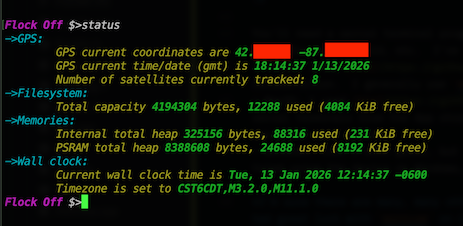
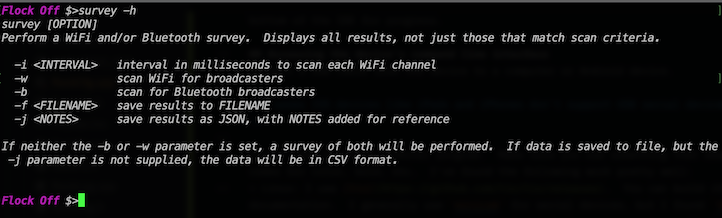

# General instructions for developing
## Prerequisites
### Clone or fork this repo
Guessing you've already done that.

### Install Arduino IDE
As stated in the main README, this project is using the Arduino IDE instead of VS Code/PlatformIO because I am very turned off of the way Copilot is being pushed into my face in VS Code.  Screw that.

*For the love of God, let's hope qualcomm doesn't fuck up Arduino and start adding AI bullshit.*

Start by going to the [Arduino website](https://docs.arduino.cc/software/ide/) to download the IDE.  **Don't use the cloud version - work locally**.  Get the installer for your flavor of OS and install it in the normal way.

### Get the needed board/library stuffs for the project
Start the Arduino IDE.  From the menu, select `Tools >> Boards >> Board Manager...`.   

Enter `esp32` into the filter box.  There should only be two results.

Be sure to select the "esp32 by Espressif" version, and click the `Install` button.  Once the board is selected, the IDE will download and install the compiler toolchain and standard libraries for the architecture.

Now for the libraries.  From the menu, select `Tools >> Manage Libraries...`  Using the Filter, search for and install the following four libraries (be sure to install the correct libraries, there are many with similar names to choose from):

+ ArduinoJson by Benoit (7.4.2)
+ EspSoftwareSerial by Dirk Karr, Peter Lerup (8.1.0)
+ LiteLED by Xylopyrographer (3.0.1)
+ NimBLE-Arduino by h2zero (2.3.7)

### Load project
From the Arduino menu, select `File >> Open...`.  Navigate to the project folder cloned from Git and open `./src/Flocker/Flocker.ino`  The main c++ file will open, along with all of the other support headers/source files in the source folder.

### Select and configure board
From the Arduino toolbar, click the `Select Board` drop down box, and click the `Select other board and port...` item.  Scroll through the list of boards and select `ESP32S3 Dev Module`. 

After choosing the board, select `Tools` from the Arduino menu.  The bottom half of the menu is used to configure the particular board in use.  Make the following changes to the items listed:
+ USB CDC on Boot -> change to `Enabled`.  This is needed to allow the built-in USB to serial converter and the command line interface
+ Flash -> change to `8MB`; this module has 8MB of flash instead of the normal 4Mb
+ Partition -> change to `Custom`.  There is a custom partition file in the project directory to set up how the 8MB flash is configured.  Generally, it's 4MB for application and 4MB for internal flash file system.
+ PSRAM -> change to `OPI PSRAM`.  The module has an extra 8MB of RAM available for use.  

## Test compile 
To test the installation and configuration, try to build the project.  From the Arduino menu, select `Sketch >> Verify/Compile` .  The `Output` window on the bottom of the IDE will show `Compiling sketch...` along with a progress bar.  This will take several minutes the first time, just let it run.

Once complete, the `Output` window should display something like:
```
Sketch uses 1205591 bytes (7%) of program storage space. Maximum is 16777216 bytes.
Global variables use 52972 bytes (16%) of dynamic memory, leaving 274708 bytes for local variables. Maximum is 327680 bytes.
```

#### Viewing full build Output
If you're interested, use the Arduino preferences menu and enable `verbose output`

## Loading device
From the Arduino menu, select `Tools >> Port...` and select the serial port where the device is connected to your computer.  On Linux, it should be something like `/dev/ttyACM0`; on MacOS look for something like `/dev/cu.usbmodemXXXXX`; and on Windows it should be  like `COMx`.  (I can't verify it on Windows - I don't have a Windows box to try it.)

Make sure you don't have the device open in a serial terminal, then from the Arduino menu, select `Sketch >> Upload`.  This will start a full build and then try to upload to the device.

On a 2020-era Intel Mcbook Air, the build process takes about 2 minutes, and then another minute or so to prepare and upload the binary to the device.  On a 2023-era Intel Linux computer, it's about half that for both.  Either way, watch the status box at the bottom of the IDE for progress.

## Accessing the device's command line interface
Connect a USB cable from the device to a computer or Android device.  

*It seems IOS devices like iPads and iPhones don't support USB serial device communication - if you find otherwise, please let me know!*

You'll need a serial terminal program.  Make sure you use something that emulates a VT-102 type terminal - the CLI uses ANSII escape codes for color, bold, etc.  I've found the following work pretty well:
+ Linux: I use [tio](https://github.com/tio/tio/releases).  You can build it from source or install it as a snap.  See the documentation.  I generally use `minicom` for serial devices, but I found `tio` did a better job with VT-102 emulation.
+ MacOS: I used [tio](https://github.com/tio/tio/releases).  Again, build from source or install with Mac Homebrew.  I tried some GUI serial terminals from the App store, but none of the free terminals I tried handled VT-102.  Your mileage may vary, or maybe a paid app would work better.
+ Android: [Serial USB Terminal](https://play.google.com/store/apps/details?id=de.kai_morich.serial_usb_terminal&pli=1)  This seems to work reasonably well on my Pixel phone; would probably be better on an Android tablet.  
+ Windows: Just a wild guess, but I would try [PuTTY](https://www.chiark.greenend.org.uk/~sgtatham/putty/latest.html).  I haven't tried using the device on Windows, but I have had good results with PuTTY for VT102 emulation.

*I'm sure there are many, many other serial terminal alternatives to use; these are just my preferences and suggestions.  I've also had great luck with `minicom` on Linux/MacOS.*

Connect the USB cable, start up your terminal of choice.  Serial parameters are 115200 baud, 8N1.  Hit the `<RETURN>` key and you should get the prompt.  To test, try the `status` command:  


Use the `help` command to get a list of commands.  Each command has specific help that can be seen with the '-h` parameter, for example:  


## Troubleshooting
A fresh pull/clone of the `main` branch should always produce a working binary to load.  

If a `main` build isn't working, try the following:
| Symptom | Try this |  
| --- | --- |  
| Hard bootloop, large LEDs do not flash or show solid blue, computer sees device, but Arduino and/or serial won't connect, etc. | Follow [instructions here](https://wiki.seeedstudio.com/xiao_esp32s3_getting_started/#bootloader-mode) to force the EPS32 into bootloader mode and reload from Arduino |  
| Device bootloops, CLI on serial terminal briefly shows `failed to init` | In the Arduino IDE menu, select `Tools` and make sure `PSRAM` is set to "OPI PSRAM", and `Partition Scheme` is "Custom".  If not, set correctly and re-upload to device |  
| Device appears to be operating, Arduino can load firmware, serial terminal connects, but no CLI response | In the Arduino IDE menu, select `Tools` and make sure `USB CDC on Boot` is set to "Enabled".  If not, set to "Enabled" and re-upload to device |  

*NOTE:  IF YOU UPDATE THE ARDUINO IDE (AND SOMETIMES JUST RANDOMLY), THE IDE WILL RESET ALL OF THE BOARD SETTINGS!*  So, if things suddenly stop working, go to the `Tools` menu and verify the board settings (CDC on Boot, PSRAM, Partitioning Scheme, Flash size, etc.).

If none of those work, open an issue in this repo.

 ## Debugging
 Add a lot of `Serial.write("Got here #1\r\n");` statements to the code....  Just kidding.
 
 The Arduino IDE and ESP32 libraries do include a full debugger (step, breakpoints, etc.).  This is the proper way to go.  Search online for examples of how to do this if you are unfamiliar with using a debugger.
 
 Yes, sometimes it is more expedient to add `print` statements to show variables and state, and you can of course do this.  There is also a logger class that will save logging info to rolling files that can be used; enable it with the `config` CLI command.  Look for  `flockLog.addLogLine()` statements for examples on use.

## Some last developer notes
The code is c++.  There are a couple of external libraries used (that is, outside of the ESP32 and Arduino libraries):
+ `minmea` is from Kosma Moczek <kosma@cloudyourcar.com>, and is used for the GPS handler.  Minor mods were made to better match this project.  Look for files `./src/Flocker/minmea.cpp` and `./src/Flocker/minmea.h`
+ `embedded_cli` is from Sviatoslav Kokurin (funbiscuit).  It is used for the command-line interface, and also has been slightly modified for use here.  Look for `./src/Flocker/embedded_cli.h`

You may notice a mix of `new/delete` and `malloc/free` (actually `ps_malloc()`).  This is generally a bad thing that leads to heap corruption, but in this case is intentional.  There are two heaps in play here; one heap in the internal SRAM which uses `new/delete`, and the other in the PSRAM chip.  That external memory is using `ps_malloc() and free()` for it's heap.  If you add anything that will dynamically use memory, try to do it with `ps_malloc()` so that it is allocated in the external 8MB PSRAM.  Slightly slower, but much better.
