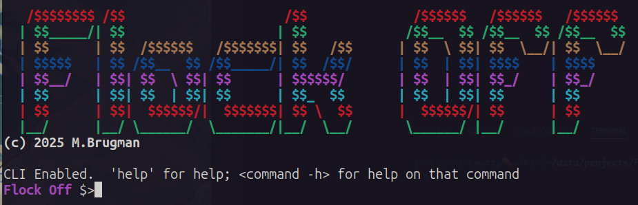
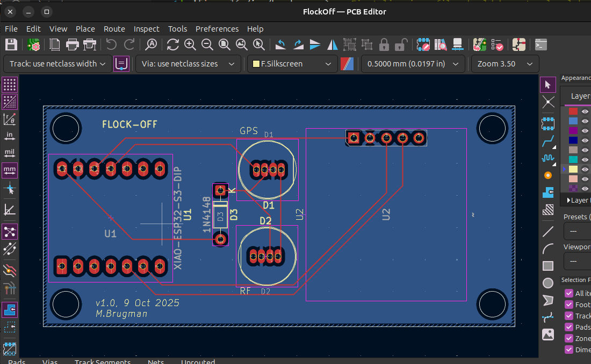
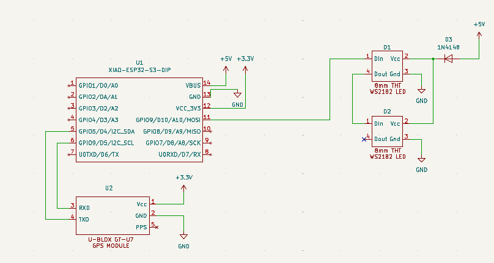
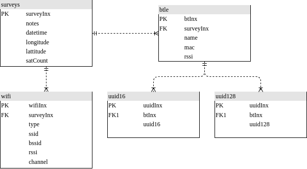

# FlockOff
This project started as a device specifically to detect Flock security ALPR devices, but has grown into a more generic WiFi/Bluetooth LE scanner/alert wardriving tool.

## Description
This started of strictly as a Flock detector, but grew into more.  In general, it is a device to monitor WiFi and BTLE networks, setting an indicator whenever a broadcaster is found that meets preset parameters.  For WiFi networks, those parameters can be a MAC OID or network name (SSID).  For Bluetooth, the matching critera can be name, MAC, or by specific 16-bit UUIDs.

The hardware device consists of an ESP32-S3 dev board, a serial GPS module, and two LEDs for signalling.

There is a serial interface to the hardware device with a rich CLI (command-line interface).  The device can also be used stand-alone (results are stored to internal file system) or by scripting.

## Project structure
The files contained in the project:
+ `./hardware` - contains a KiCad project for the board
+ `./img` - images used in this README
+ `./py` - simply python3 script to interact with the flocker (notes below)
+ `./src` - source code (arduino project) for the ESP32 (notes below)
+ `./case` - sample 3D printer `.stl` and openSCAD files for a case

### Hardware


The hardware is dead simple - two dev modules, two through-hole 8mm WS2812 LEDs, and a small signal diode:
+ [ESP32-S3](https://www.amazon.com/Dual-core-Supported-Efficiency-Interface-Robotics/dp/B0DJ6NQFKX/ref=sxin_17_pa_sp_search_thematic_sspa?content-id=amzn1.sym.acab9f82-fc77-4a20-9021-7b5c22d80ec5%3Aamzn1.sym.acab9f82-fc77-4a20-9021-7b5c22d80ec5&crid=2JDD3FE6II334&cv_ct_cx=esp32s3&keywords=esp32s3&pd_rd_i=B0DJ6NQFKX&pd_rd_r=111273b0-33b8-492d-943f-a421e25d3cd0&pd_rd_w=tgPcF&pd_rd_wg=AKjP3&pf_rd_p=acab9f82-fc77-4a20-9021-7b5c22d80ec5&pf_rd_r=M8JMDJXXJ54DR9BMEQC6&qid=1765833241&s=electronics&sbo=RZvfv%2F%2FHxDF%2BO5021pAnSA%3D%3D&sprefix=esp32s3%2Celectronics%2C142&sr=1-2-6024b2a3-78e4-4fed-8fed-e1613be3bcce-spons&aref=L2fTwRUg09&sp_csd=d2lkZ2V0TmFtZT1zcF9zZWFyY2hfdGhlbWF0aWM&th=1) I picked this module because of small size, good price, and 8MB of both flash and PSRAM
+ [GPS Module](https://www.amazon.com/hiBCTR-Navigation-Positioning-Microcontroller-Sensitivity/dp/B0FL71WTQY/ref=sr_1_2?crid=2EM3EOXRCSTFT&dib=eyJ2IjoiMSJ9.XRWR-WnPLsz7cVN0GpjqJTxFRMO10MBskzPEVvz5LCTDXAtxa_rXf2wQrFndRzU50l7y__POWiiDMUXVK5OIa7VqEst8IqFH4xFvcnBHg-U0VY4qNZQPKFdzWL5Evdyj4AFWD0VpzcrnOxwnca7-Dr8wspdKucj2aYc0Gtoa1uRUl7K4ES9h20ztgmGDT3mPrt2tiQ-HN-FAgOPFQVPE3Pudl5vF2LNCPSp00W8Bhg5xvlYpIlCSGdX8GwmWiVH8u0OJW8YW5ridkpLchugFbq4H7w5SYdWBFkT73FZqAvk.YyvKMYAZdg815_BV_j8Fv4HH-0O0dOLUrndqKjRR0CQ&dib_tag=se&keywords=4+Pack+GPS+Module%2C+NEO-6M+Navigation+Positioning%2C+Arduino+GPS+for+Drone+Microcontroller%2C+High+Sensitivity+Receiver+with+Antenna%2C+Compatible+with+51+Microcontroller+STM32+Arduino+UNO+R3&nsdOptOutParam=true&qid=1765833097&s=electronics&sprefix=4+pack+gps+module%2C+neo-6m+navigation+positioning%2C+arduino+gps+for+drone+microcontroller%2C+high+sensitivity+receiver+with+antenna%2C+compatible+with+51+microcontroller+stm32+arduino+uno+r3%2Celectronics%2C158&sr=1-2) There is notthing special about this particular module; it is a basic GPS with NMEA serial interface, it was cheap, and in stock at Amazon
+ [WS1812 LEDs](https://www.adafruit.com/product/1734)  These are interesting in that they are the typical addressable LEDs, but in a through-hole 8mm package.  They are great for using as signalling/status indicators.  Also handy because there are so many libraries to work with them.
+ [1N4148 Diode](amazon.com/ALLECIN-1N4148-Schottky-Switching-Package/dp/B0CKRMK45V/ref=sr_1_6_sspa?dib=eyJ2IjoiMSJ9.5f18Rx_7lMSBN-40Nk5_scirzd5gVqG_sr48GsP-pxJ7RyARr5GHbm76WgpJle4ywCwcEGfv6m5ZR-PIBoBmRN28qtEe29DQYY84c263_q6oFDujaGGVK8-qabhrRd_IZtu2PwFHkKMBdiIw8IDQjSYkBxPm9DKi_AA6exCA7rmOiWGNdN9Oq0D-5c1H1XGK1kBii_ftCc-F3YiORaBovQ5vkFW9kAN3zzAu7IgDKEk.RF6rc4KmtAVvY9uUuLV-Zf6xt-HBLaOGQf1vvRW5V2U&dib_tag=se&keywords=1n4148&qid=1765833550&sr=8-6-spons&sp_csd=d2lkZ2V0TmFtZT1zcF9tdGY&psc=1) (Amazon link for reference, I had some in my parts bin).  This is used because it has a forward voltage drop of about .7V.

#### What's up with the diode?


Like pretty much all WS2812 LEDs, these need 5VDC to operate; 5VDC power, 5VDC data line.  The ESP32 is a 3.3 microcontroller, so what to do?

The USB connection supplies 5V which is regulated down to 3.3V for the microcontroller and associated stuff.  In the schematic above, `D3` is shown between the 5V USB power and the LED power in pin; that drops the voltage to about 4.3VDC.  That's just within spec for the LED, and it is still plenty bright.

The 3.3V signal data line from the ESP32 would be too low if the LED was powered by 5V, but is just enough with the LED at 4.3-ish.  It's a cheat to get away without having to use level converters; not something I'd do for a "real" production project, but good enough for here.

### Firmware
The firmware is written using the Arduino IDE.  In the past, I've always avoided that and used VS Code with my own Makefile or CMAKE, PlatformIO, or whatever.  I decided to go with Arduino in this case because I'm very unhappy with the integration of Copilot into VS Code (and really, the push to shove AI into everything).  For now, Ardiuno is just code.

The libraries needed for this project are:
+ ArduinoJson (7.4.2) - for JSON, obviously
+ EspSoftwareSerial (8.1.0) - for the software UART to the GPS module
+ LiteLED (3.0.1) - for the two addressable LEDs
+ NimBLE-Arduino - for the BLE detection stuff

Of course, the core ESP32 stuff needs to be installed (I'm using the Espressif ESP32 board package, v3.3.3).

In addition, the board configuration is:
+ Board: `ESP32S3 Dev Module`
+ USB CDC on Boot: `Enabled`
+ Flash Mode: `QIO 80MHz`
+ Flash Size: `8MB`
+ Partition Scheme: `Custom` - see `./src/partitions.csv`, but basically 3MB application, 4MB filesystem
+ PSRAM: `OPI PSRAM`
I believe everything else is default.

### CLI Interface
There is a CLI available at the USB port at 115200/8N1.  The CLI uses ANSII escape codes for color, has tab-completion, up-arrow recall, and help:
```  
Flock Off $>help 
Use 'command -h' for detailed help on each command
	help - Print list of commands
	survey - Perform Wifi survey
	clear - Clear the console
	reset - Reboot the device
	ls - List files
	rm - Delete file
	write - Write test file
	mv - Rename file
	cp - Copy file
	cat - Cat file
	status - Get system status
	config - Get/Set config values
```  
Passing a `-h` to any command will show help for that command, for example:
```  
Flock Off $>survey -h
survey [OPTION]
Perform a WiFi and/or Bluetooth survey.  Displays all results, not just those that match scan criteria.

  -i <INTERVAL>   interval in milliseconds to scan each WiFi channel
  -w              scan WiFi for broadcasters
  -b              scan for Bluetooth broadcasters
  -f <FILENAME>   save results to FILENAME
  -j <NOTES>      save results as JSON, with NOTES added for reference

If neither the -b or -w parameter is set, a survey of both will be performed.  If data is saved to file, but the -j parameter is not supplied, the data will be in CSV format.
```  
There is a flat filesystem included (flat, meaning no directories; all files are in a single directory). Basic Linux-type file management commands are available, but note that there is no 'globbing'; all filenames must be directly entered.  Examples:
```  
Flock Off $>ls 
	   208  config.bak
	   207  config.json
	   306  survey.00.json
	  3840  survey.01.json
	   408  system.log
Flock Off $>cat config.json
{"deviceName":"SuperSecret Sniffer","timeZone":"CST6CDT,M3.2.0,M11.1.0","LEDBrightness":128,"debugEnabled":true,"debugLogRollCount":3,"minRSSI":-85,"WifiAPs":["flock","fs ext Battery","penguin","pigvision"]}
```  
Configuration is menu-driven:
```  
Flock Off $>config 
1) Set device name (SuperSecret Sniffer)
2) Set timezone (CST6CDT,M3.2.0,M11.1.0)
3) Set max LED brightness (128)
4) Set debug logging (enabled)
5) Set debug file rolling count (3)
6) Set minimum RSSI (-85)
Select number of item to change or 'x' to exit with no changes: 
```  
## LEDs
What do the LEDs do?
### GPS LED
| color | description |  
|---|---|  
| Green blink | GPS Fix good, communication good |  
| Purple blink | GPS no fix, communication good |  
| Red blink | No comms to GPS module |  

### RF LED
| color | description |  
|---|---|  
| Blue fade alert | Survey in progress | 
| Red fade alert | Target device in range |  

## Performing a site survey
A survey will report all WiFi and BTLE broadcasters in range.  Why perform a survey?  Maybe there's a known device that isn't triggering alerts, and we want to characterize it (find MAC address, if BT, see if there are any service UUIDs it's broadcasting).

Basic steps:
1) Connect to the device with a serial terminal of your choice (PuTTY on Windows, TIO/minicom oon Linux, whatever on MAC).
2) Use the `status` command to be sure GPS has gotten a fix and that the data looks correct (GPS coordinates masked by me for privacy):
``` 
Flock Off $>status 
->GPS:
	GPS current coordinates are 42.XXXXX, -87.XXXXX
	GPS current time/date (gmt) is 21:51:54 11/15/2025
	Number of satellites currently tracked: 7
->Filesystem:
	Total capacity 4194304 bytes, 16384 used (4080 KiB free)
->Memories:
	Internal total heap 325156 bytes, 88340 used (231 KiB free)
	PSRAM total heap 8388608 bytes, 24688 used (8192 KiB free)
->Wall clock:
	Current wall clock time is Mon, 15 Dec 2025 15:51:54 -0600
	Timezone is set to CST6CDT,M3.2.0,M11.1.0
```  
3) Use the `survey` command to start the survey.  Parameters are:
   + `-i INTERVAL` defines how much time (milliseconds) to spend on each WiFi channel
   + `-w` for WiFi only, `-b` for BTLE only (or neither for both)
   + `-j NOTES` to save the results in a JSON file, with survey notes set to `NOTES`
   + `-f FILENAME` to save results
```  
Flock Off $>survey -i 2000 -j 'Example survey' -f survey.example.json
Survey starting.
Starting WiFi.
Setting channel 1...2...3...4...5...6...7...8...9...10...11...12...13...36...40...44...48...149...153...157...161...165
WiFi done.
Starting BLE
SCANNER::stopBLE() - scanner was non-null
BLE Done, survey complete, found 21 devices
Found 33 devices:

Saving survey results to survey.example.json, format JSON
Wrote 4371 bytes to file
```  
This example survey found 12 WiFi devices (or channels on devices), and 21 BTLE devices.  The data in the JSON file looks like this (truncated): 
```
Flock Off $>cat survey.example.json
{"SurveyNotes":"'Example","LocationLongLat":[-87.94199,42.8945],"SatelliteCount":8,"DateTime":"2025-12-15 15:56:52","Timezone":"CST6CDT,M3.2.0,M11.1.0","WiFiDevices":[{"Method":"WiFi","Subtype":"beacon","BSSID":"b2:28:aa:1c:0a:29","Channel":2,"SSID":"flu","RSSSI":-51},{"Method":"WiFi","Subtype":"beacon","BSSID":"b2:28:aa:1c:0a:2a","Channel":1,"SSID":"flu_IoT","RSSSI":-52},{"Method":"WiFi","Subtype":"beacon","BSSID":"b2:28:aa:1c:0a:2a","Channel":2,"SSID":"flu_IoT","RSSSI":-53},{"Method":"WiFi","Subtype":"probe response","BSSID":"b2:28:aa:1c:0a:2a","Channel":2,"SSID":"flu_IoT","RSSSI":-54},{"Method":"WiFi","Subtype":"beacon","BSSID":"a0:36:bc:db:ca:a0","Channel":12,"SSID":"virus","RSSSI":-52},
```  
### Interpreting survey results
The included python scripts can pull the survey data from the device and populate some database tables (sqlite3) for analysis.

To do this, start by going to the `./py` directory and running the script.  There are some Python modules needed; they can be installed with the included requirements file (`pip3 install -r requirements.txt`)

*Note - it is always recommended to use a virtual environment with python scripts that require different modules.  See python documentation on how to create and use a virtual environment if necessary.*

Start by listing the files on the device (make sure you are no longer connected to it by serial terminal):
```  
┌──(venv)─(matty💊s76)-[~/data/projects/FlockOff/py]
└─$ python3 ./flock.py --dbfile example.db --port /dev/ttyACM0 --dir                
config.bak
config.json
survey.00.json
survey.01.json
survey.example.json
system.log
```  
The parameters to the `flock.py` script are:
+ `--port PORT` - the serial port of the connected device
+ `--dbfile FILE` - name of the database file to use (it will be created if it does not exist).  This is only required if the `load` command is issued.
+ Command - this is one of a few commands:
  + `--dir` - list the files on the device
  + `--cat FILE` - list the contents of the specified file
  + `--load FILE` - load the specified JSON file into database tables'
  + `--download FILE` - download the specified FILE from the device to the local filesystem.  The local copy will have the same name as the file on the device.

The above `--dir` comamnd showed our `survey.example.json` from the survey.  Let's load it into the database tables:
```  
┌──(venv)─(matty💊s76)-[~/data/projects/FlockOff/py]
└─$ python3 ./flock.py --dbfile example.db --port /dev/ttyACM0 --load survey.example.json
Loaded 12 WiFi devices, 21 BTLE devices from survey "'Example" at 2025-12-15 15:56:52
```  

Note that if the database file didn't exist before this command, the script will also populate the data tables with the YAML and JSON files for known manufacturer OID and UUID data.


### Survey database

The database schema can be seen in `./src/py/survey.db.schema`

The sqlite3 database can be explored with a gui tool or the command line.  The `surveys` table shows basic information about the a survey json file (using `sqlite3` command line tool):
```  
sqlite> .mode box
sqlite> .headers on
sqlite> select * from surveys;
┌───────────┬──────────┬─────────────────────┬───────────┬───────────┬──────────┐
│ surveyInx │  notes   │      dateTime       │ longitude │ lattitude │ satCount │
├───────────┼──────────┼─────────────────────┼───────────┼───────────┼──────────┤
│ 1         │ 'Example │ 2025-12-15 15:56:52 │ 42.0001   │ -87.0001  │ 8        │
└───────────┴──────────┴─────────────────────┴───────────┴───────────┴──────────┘
```  
 The `surveyInx` field is a foreign key into the `wifi` and `btle` tables.  This allows multiple surveys to be loaded into a single database file

`notes` is the value from the `-j NOTES` parameter of the `survey` command.  `dateTime`, `longitude`, `lattitude`, and `satCount` are populated by the GPS module.

The `wifi` table contains discovered broadcasters.  To list all of that data for this survey:
```  
sqlite> select w.type, w.ssid, w.bssid, w.rssi, w.channel from wifi as w join surveys s on w.surveyInx = s.surveyInx where w.type not like 'probe request' order by w.bssid;
┌────────────────┬──────────┬───────────────────┬──────┬─────────┐
│      type      │   ssid   │       bssid       │ rssi │ channel │
├────────────────┼──────────┼───────────────────┼──────┼─────────┤
│ beacon         │ virus    │ a0:36:bc:db:ca:a0 │ -52  │ 12      │
│ beacon         │ virus    │ a0:36:bc:db:ca:a0 │ -51  │ 11      │
│ beacon         │ flu      │ b2:28:aa:1c:0a:29 │ -51  │ 2       │
│ beacon         │ flu      │ b2:28:aa:1c:0a:29 │ -53  │ 1       │
│ probe response │ flu      │ b2:28:aa:1c:0a:29 │ -53  │ 2       │
│ beacon         │ flu_IoT  │ b2:28:aa:1c:0a:2a │ -52  │ 1       │
│ beacon         │ flu_IoT  │ b2:28:aa:1c:0a:2a │ -53  │ 2       │
│ probe response │ flu_IoT  │ b2:28:aa:1c:0a:2a │ -54  │ 2       │
│ beacon         │ <HIDDEN> │ cc:28:aa:1c:0a:28 │ -53  │ 2       │
│ beacon         │ <HIDDEN> │ cc:28:aa:1c:0a:28 │ -51  │ 1       │
└────────────────┴──────────┴───────────────────┴──────┴─────────┘
```  
`type` is the type of 802.11 wifi management packet was captured (beacon, probe request, probe response, etc.), `ssid` is the broadcast ssid, `bssid` is the MAC of the broadcaster, `rssi` is signal strength, and `channel` is the wifi channel.

In this case, there were 3 unique MAC addresses seen, all of relatively the same signal strength.

The `btle` table contains bluetooth broadcasters:
```  
sqlite> select b.name, b.mac, b.rssi from btle as b join surveys s on b.surveyInx = s.surveyInx order by b.mac;
┌───────────────────────┬───────────────────┬──────┐
│         name          │        mac        │ rssi │
├───────────────────────┼───────────────────┼──────┤
│                       │ 01:c5:61:6d:2c:b4 │ -53  │
│                       │ 04:a0:29:10:68:e4 │ -78  │
│                       │ 08:66:98:f2:a3:ba │ -84  │
│                       │ 34:fe:3e:a1:f5:e2 │ -63  │
│                       │ 56:f6:b3:ad:60:5f │ -82  │
│                       │ 66:7f:66:1d:ec:ce │ -68  │
│                       │ 6d:67:db:fd:9e:67 │ -84  │
│                       │ 6e:d3:64:c3:af:77 │ -79  │
│                       │ 77:50:8c:84:fa:72 │ -45  │
│                       │ 78:90:0b:c0:26:1b │ -69  │
│                       │ 7e:91:43:7c:ff:bf │ -75  │
│ OfficeJet 5200 series │ 86:a9:3e:bc:5c:c9 │ -76  │
│                       │ 8c:ea:48:a7:2c:03 │ -73  │
│                       │ a8:51:ab:c6:11:25 │ -82  │
│                       │ c0:c9:9b:f2:d7:43 │ -75  │
│                       │ c1:cf:e2:c9:64:5f │ -85  │
│                       │ ca:ba:59:12:f6:0d │ -66  │
│ N00DM                 │ ce:a3:ad:95:04:29 │ -80  │
│                       │ d5:93:9d:03:9f:f5 │ -80  │
│                       │ ea:a8:d0:6f:67:89 │ -84  │
│                       │ ec:9d:4d:3c:28:2b │ -68  │
└───────────────────────┴───────────────────┴──────┘
```  
There are quite a few BTLE devices found.  To narrow it down to those that are broadcasting a UUID:
```  
sqlite> select b.name, b.mac, u.uuid16 from btle b join uuid16 u on b.btInx = u.btInx where b.surveyInx = 1 order by b.mac;
┌───────────────────────┬───────────────────┬────────┐
│         name          │        mac        │ uuid16 │
├───────────────────────┼───────────────────┼────────┤
│ OfficeJet 5200 series │ 86:a9:3e:bc:5c:c9 │ 65144  │
│ N00DM                 │ ce:a3:ad:95:04:29 │ 65199  │
└───────────────────────┴───────────────────┴────────┘
```

**More SQL examples can be found in `./example.sql`**
