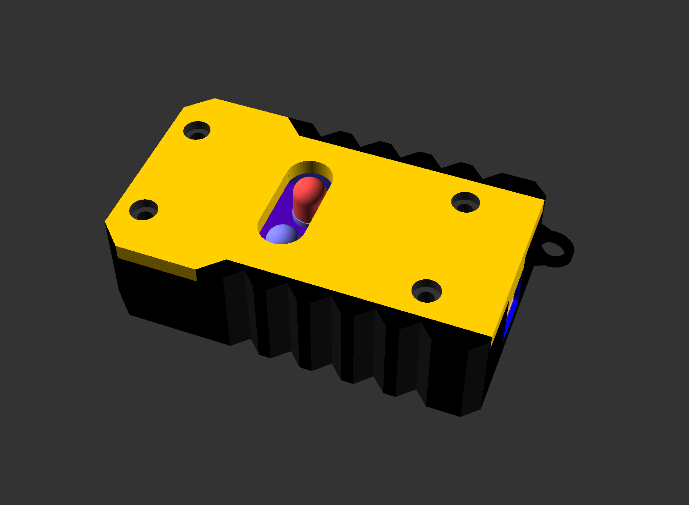

# Some general notes on constructing the device
## PCB
The `./hardware` folder has a KiCAD project for the PCB.  This should be sufficient if you are using the components listed in the `README.md` file.  (Yeah, I'll make a BOM at some point).  KiCAD can be used to generate gerber files for a board house or home fab (if you have those capabilities).  The original prototypes were done at [OSHPark](https://oshpark.com).  With standard service, the total was just under $20USD for 3 boards and took about 3 weeks for them to arrive.

The board has four 4mm through holes in the corners for mounting.  This drawing shows the dimensions of the board, locations of the mounting holes, and the center point of the two 8mm LEDs (all dimensions in millimeters):


## Soldering
The board is designed with all through-hole components for easy home soldering.  The only tricky components are the two LEDs; they are 0.050" pitch, so be sure to use a fine point on the soldering iron and a bit of flux to prevent solder bridges.  Everything else is on 0.100" pitch and one PTH component.

When soldering the LEDs, be mindful of the flat edge of the base - align that side of the LED with the flat on the silkscreen of the PCB. Note that they are in opposite orientations!

## Case/Enclosure

The `./case` folder has an OpenSCAD file for a sample enclosure, with included `.stl` files.  Feel free to use that one, remix it, make your own, or don't use one at all.

If you are using the included OpenSCAD file, look for `main` near the end of the file.  The file is the complete enclosure, along with a very rough representation of the PCB and GPS antenna for reference.  When working with the file, you can show/hide different parts by simply commenting/uncommenting lines in `main`:
```  
module main()
{
    // the whole shebang
    bottom(90, 42, 20);
    top(90, 42, 4, 20);
    pcb(-5, 0, 10);
    antenna();
    lanyardRing(42, 18, 12);
    //posts();
}
```  
For example, commenting out everything but `bottom()` will turn off everything except the geometry for the bottom part of the enclosure.

The sample enclosure is held together with 4 3mm SHCS and requires 4 3mm threaded inserts to placed in the bottom.

The OpenSCAD file isn't the cleanest thing I've ever written.  I use OpenSCAD because it is very intuitive to me and I don't want to take the time to learn something like FreeCad :)

If you come up with a different enclosure, feel free to add it here with a PR.
